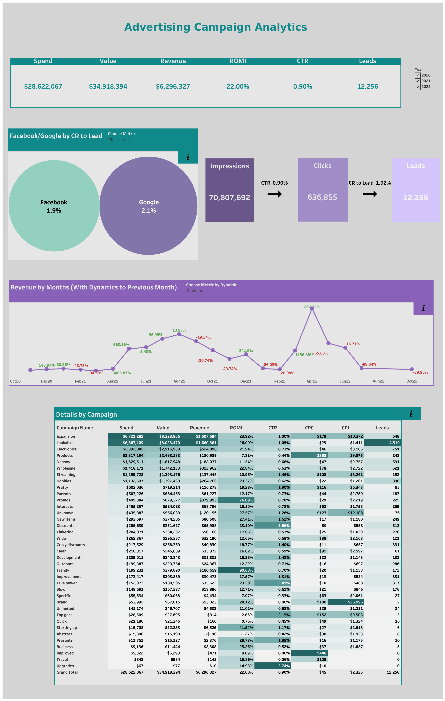

# Advertising Campaign Analytics Dashboard

## Project Overview

This project focuses on analyzing the performance of advertising campaigns across different marketing channels.

The main goal is to evaluate how efficiently the marketing budget was used, identify the most profitable campaigns, and analyze the full funnel from impressions to leads and revenue.

The dashboard provides an overview of key marketing metrics such as Spend, Revenue, ROMI, CTR, CPC, CPL, Leads, and Conversion Rate to Lead. It also allows users to compare campaign performance, track the dynamics of key metrics over time, and evaluate the performance of Facebook and Google channels.

## Key Metrics

- **Spend** — total advertising costs

- **Revenue** — total revenue generated by campaigns

- **ROMI** — return on marketing investment

- **CTR** — click-through rate

- **CPC** — cost per click

- **CPL** — cost per lead

- **Leads** — number of generated leads

- **CR to Lead** — conversion rate from clicks to leads

## Dashboard Features

- Overview of key KPIs: spend, revenue, ROMI, CTR, and number of leads

- Funnel from impressions to clicks and leads

- Comparison of Facebook and Google by key metrics with the ability to switch metrics using the **Choose Metric** parameter

- Analysis of monthly dynamics of key metrics compared to the previous month, with the ability to switch metrics using the **Choose Metric** parameter

- Campaign-level performance breakdown

- Interactive filters:

  - clicking a bubble in the **Facebook/Google** section filters all dashboard elements by the selected channel

  - clicking a campaign name in the **Details by Campaign** section filters all dashboard elements by the selected campaign

## Business Questions

This dashboard helps answer the following questions:

- Which campaigns generate the highest revenue and ROMI?

- Which campaigns are inefficient and require budget optimization?

- How do key metrics change over time?

- Which channel generates higher revenue and has a better conversion rate to lead?

- How efficiently do users move through the funnel from impressions to leads?

## Goal

The goal of this project is to create an analytical dashboard that helps marketing teams monitor advertising campaign performance, evaluate budget efficiency, and make data-driven decisions about scaling or optimizing campaigns.

